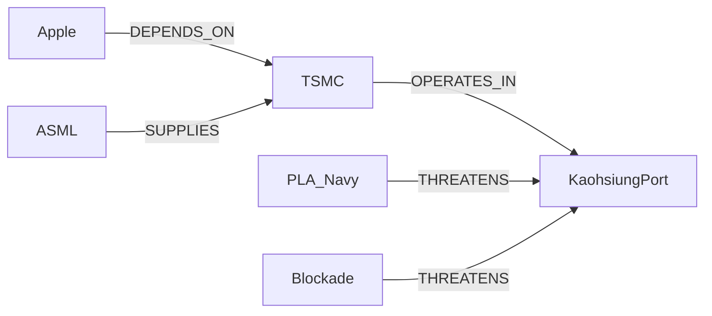
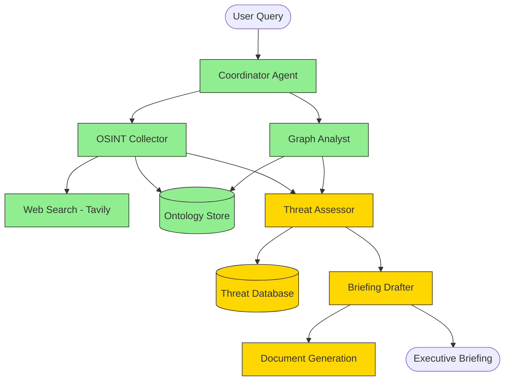
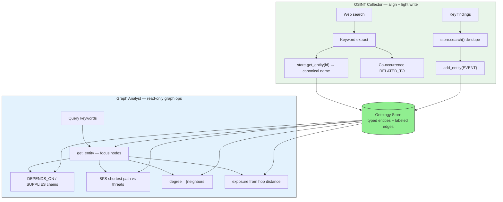
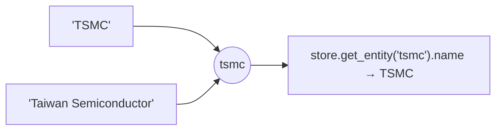
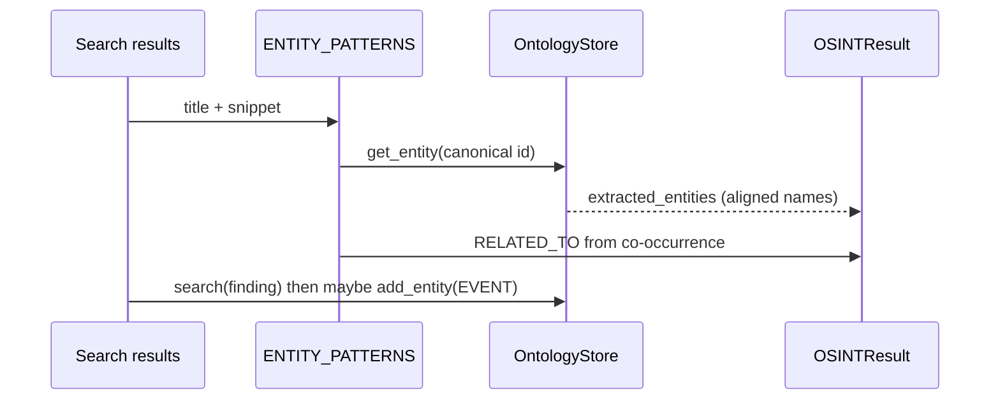
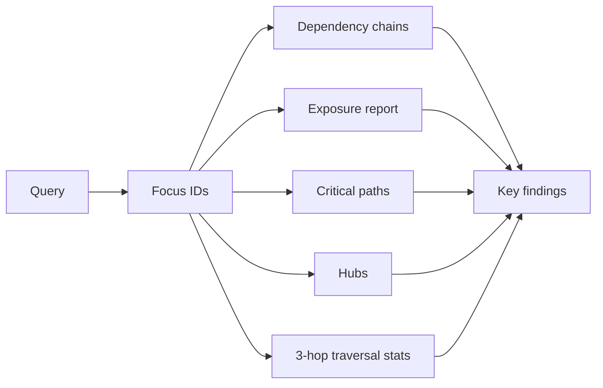
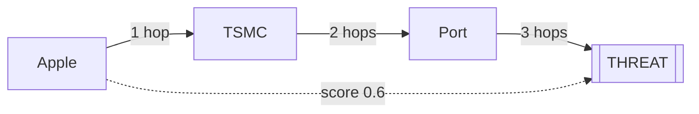
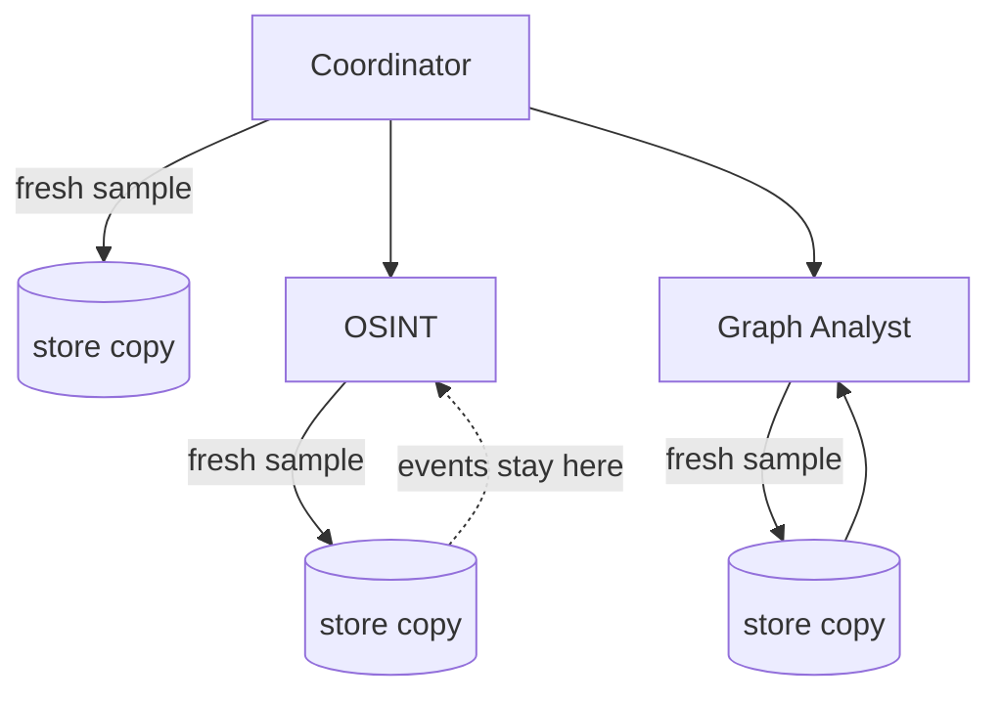

# Palantir Ontology Agents

> **Alex Karp**: *"The demand for AIP, in virtually every context, is extraordinary."*
>
> This multi-agent system shows what agentic workflows on the ontology look like in practice.

A working multi-agent system built with LangGraph that demonstrates how specialist agents coordinate over an ontology-structured data layer to produce actionable intelligence -- mirroring Palantir AIP's agentic workflow architecture.

**Demo scenario**: 4 agents analyze a Taiwan Strait supply chain disruption, traverse a 50-entity ontology graph, assess threats, and deliver an executive briefing in under 2 minutes.

## What that sentence means

Palantir AIP is not "several chatbots." Agents share one typed object graph and hand off structured state. This repo is a runnable sketch of that pattern.

| Clause | Meaning here |
|--------|----------------|
| **A working multi-agent system** | An executable path, not a slide: shared state, real nodes, a briefing at the end. Four specialists, 50+ entities, 100+ edges. |
| **built with LangGraph** | A `StateGraph` decides order and fan-out: Coordinator, then OSINT ∥ Graph Analyst, then Threat Assessor, then Briefing Drafter. |
| **coordinate over an ontology-structured data layer** | Agents query typed entities and labeled edges (SUPPLIES, DEPENDS_ON, THREATENS), not a pile of unaligned web pages. |
| **produce actionable intelligence** | Exposure scores, threat assessment, and an executive briefing — not another news recap. |

Two layers, one pipeline:

```text
Orchestration (LangGraph)     Data (Ontology Store)
  who runs, in what order       typed objects + semantic edges
  src/graph/workflow.py         src/ontology/
```



Read the graph: Apple depends on TSMC; ASML supplies TSMC; TSMC ships through Kaohsiung; navy and a strait blockade both threaten that port. Exposure walks upstream along `DEPENDS_ON`.

| Question | LLM + web pages | Agents on an ontology |
|----------|-----------------|------------------------|
| Is Apple hit by a port blockade? | Model guesses from memory or retrieved paragraphs | Walk `DEPENDS_ON` / `OPERATES_IN`; the score is reproducible |
| How do agents name the same company? | Separate summaries; "TSMC" vs "台积电" may never join | Shared entity IDs and edges |
| What is the output? | Fluent text that is hard to audit | Graph evidence + threat score + structured briefing |

## Demo


[Watch full quality video](https://github.com/hashwnath/palantir-ontology-agents/releases/download/v1.0/demo.mp4)

## Architecture



**Green** = Live (working code) | **Yellow** = Scaffolded (mock data, clean integration points)

Orchestration is the LangGraph path above. The **Ontology Store** is the shared data layer both live collectors write to and Graph Analyst traverses — not a private JSON blob per agent.

The two live specialists use that graph differently: OSINT **aligns** open-source text onto canonical IDs (and writes a few new events); Graph Analyst **reads** the same typed edges to compute chains, hubs, and exposure.

## How OSINT and Graph Analyst use the ontology

```text
Query
  ├─ OSINT Collector     web text ──match──► canonical IDs ──write──► new EVENT nodes
  │                      co-occurrence ──► RELATED_TO (result payload only)
  └─ Graph Analyst       keywords ──► focus nodes ──traverse / path / degree / exposure──► findings
```



| Agent | Ontology role | Writes the store? |
|-------|---------------|-------------------|
| **OSINT Collector** | Dictionary of known IDs (`tsmc`, `taiwan_strait`, …) plus a place to append OSINT events | Yes — new `EVENT` nodes only |
| **Graph Analyst** | The analysis object: traversal, supply-chain chains, hubs, exposure | No |

### OSINT Collector: dictionary, then a few events

Pipeline in `src/agents/osint_agent.py`: search → extract entities → key findings → infer relationships → optional store update.

`ENTITY_PATTERNS` maps phrases in titles/snippets onto **fixed ontology IDs**. If the store already has that ID, the agent uses the official `name` so "Taiwan Semiconductor" and "TSMC" collapse to one object:



Same-article co-mentions become `RELATED_TO` edges with confidence `score * 0.8`. Those edges land in `OSINTResult.new_relationships`; they are **not** `add_relationship`'d into the store.

What *does* get written: each key finding is searched with `store.search(finding[:30])`. On a miss, a new `EntityType.EVENT` is added (`source="osint_agent"`, `confidence=0.7`). Existing orgs, ports, and threats are not mutated.



### Graph Analyst: the graph *is* the analysis

Without a store, `run()` returns immediately (`"No ontology store available"`). With one, `src/agents/graph_agent.py` plus `src/tools/ontology_tools.py` do seven read-only steps:



| Step | Store / tool API | What it means on the graph |
|------|------------------|----------------------------|
| Focus entities | `get_entity(id)` | Keywords map to `tsmc`, `taiwan_strait`, `uspacflt`, …; default to those three if nothing matches |
| Dependency chains | `get_dependency_chains` | Follow **outgoing** `DEPENDS_ON` / `SUPPLIES` / `SUPPLIES_TO`, max depth 5 |
| Exposure | `query_by_type(ORGANIZATION)` + `calculate_exposure_score` | BFS to nearest `THREAT`; score `max(0, 1.0 − (hops − 1) × 0.2)` |
| Critical paths | `query_by_type(THREAT)` + `find_path` (BFS, max 5 hops) | Shortest paths among focus ∪ threats; keep 20 shortest |
| Hubs | `all_entities()` + `get_neighbors` | Degree centrality, top 10 |
| Stats | `traverse(..., hops=3)` | Reachable size from each focus node |
| Findings | (derived) | Most-connected node, high exposure, longest chain, ≤2-hop threat paths |

Exposure is hop distance, not an LLM guess:



1 hop ≈ **1.0**, each extra hop minus **0.2**. Graph Analyst does not write edges; the `llm` constructor argument is unused.

### Same query, two graphs (demo caveat)

Coordinator, OSINT, and Graph Analyst each call `load_sample_data()`. LangGraph runs OSINT ∥ Graph Analyst in parallel, so each node gets **its own copy**. OSINT's new `EVENT` nodes do not appear in Graph Analyst's traversal in the same run.



Downstream Threat Assessor / Briefing Drafter consume **serialized results** (`osint_results`, `graph_results`), not a merged live graph.

## Live vs Blueprint

| Component | Status | Notes |
|-----------|--------|-------|
| Coordinator Agent | **Live** | Routes queries, manages ontology state |
| OSINT Collector | **Live** | Web search via Tavily, entity extraction |
| Graph Analyst | **Live** | Ontology traversal, relationship analysis, exposure scoring |
| Ontology Store | **Live** | In-memory typed graph with 50+ entities, 100+ relationships |
| Web Search Tool | **Live** | Tavily API with demo mode fallback |
| Threat Assessor | Blueprint | Mock threat data, clean integration points for classified feeds |
| Briefing Drafter | Blueprint | LLM generation with template, integration points for Palantir doc system |
| Threat Database | Blueprint | Sample data, documented API for real threat feeds |
| Document Generation | Blueprint | Template output, integration points for Palantir document pipeline |
| Foundry API Connector | Blueprint | Documented interface, mock responses |

## Quick Start

### Docker Compose（推荐）

```bash
git clone https://github.com/hashwnath/palantir-ontology-agents.git
cd palantir-ontology-agents

# Optional: copy and fill API keys (demo mode works without them)
# OPENAI_API_KEY / OPENAI_BASE_URL / OPENAI_MODEL for any OpenAI-compatible endpoint
cp .env.example .env

docker compose up --build
```

Open http://localhost:8501

```bash
# Stop
docker compose down
```

### Local

```bash
# Clone
git clone https://github.com/hashwnath/palantir-ontology-agents.git
cd palantir-ontology-agents

# Install
pip install -r requirements.txt

# Set API keys (optional -- demo mode works without them)
export TAVILY_API_KEY=your_tavily_key                    # for live OSINT web search
export OPENAI_API_KEY=your_openai_compatible_key         # for LLM-powered features
export OPENAI_BASE_URL=https://api.openai.com/v1         # OpenAI-compatible base URL
export OPENAI_MODEL=gpt-4o-mini                          # model name on that endpoint

# Run the Streamlit demo
streamlit run src/ui/app.py

# Run tests
pytest tests/ -v

# Run the orchestrator directly
python -c "
from src.orchestrator import Orchestrator
orch = Orchestrator()
result = orch.run('Track supply chain disruptions in Taiwan Strait, assess partner exposure, draft SECDEF briefing')
print(result['briefing']['briefing_text'])
"
```

## Demo Scenario: Taiwan Strait Supply Chain Disruption

The system analyzes a realistic geopolitical scenario:

- **50+ entities**: TSMC, ASML, Apple, NVIDIA, US Pacific Fleet, PLA Navy, shipping companies, ports, military assets, threat vectors
- **100+ relationships**: Supply chains, dependencies, military deployments, threat connections
- **4 specialist agents** execute in parallel and sequential phases:
  1. **OSINT Collector** searches for current intelligence (Tavily web search or demo data)
  2. **Graph Analyst** traverses the ontology to find dependency chains and exposure scores
  3. **Threat Assessor** evaluates risk with confidence scoring and historical precedents
  4. **Briefing Drafter** generates a structured executive briefing

## Ontology

The typed ontology layer is what agents coordinate *over*. It is not a document store:

- **Entity types**: Organization, Person, Location, Event, Asset, Threat
- **Relationship types**: OPERATES_IN, SUPPLIES, THREATENS, DEPENDS_ON, DEPLOYED_AT, MONITORS, and 13 more
- **Graph traversal**: N-hop queries, dependency chain discovery, exposure scoring
- **BFS shortest path**: Find connections between any two entities

That is why a question like "does a Kaohsiung blockade hit Apple?" is answered by walking the graph in the [example above](#what-that-sentence-means), not by hoping the model remembers a supply-chain article. How the two live agents actually read and write this layer is in [How OSINT and Graph Analyst use the ontology](#how-osint-and-graph-analyst-use-the-ontology).

## Project Structure

```
src/
  orchestrator.py          -- Coordinator agent, routes tasks, manages ontology state
  ontology/
    schema.py              -- Typed entity and relationship dataclasses
    store.py               -- In-memory graph store with traversal
    loader.py              -- 50+ entity Taiwan Strait scenario data
  agents/
    osint_agent.py         -- OSINT collection via web search (LIVE)
    graph_agent.py         -- Ontology graph analysis (LIVE)
    threat_agent.py        -- Threat assessment (SCAFFOLDED)
    briefing_agent.py      -- Briefing generation (SCAFFOLDED)
  graph/
    state.py               -- LangGraph AgentState schema
    nodes.py               -- Node functions wrapping agents
    workflow.py            -- StateGraph: coordinator -> [osint || graph] -> threat -> briefing
  tools/
    web_search.py          -- Tavily search with demo fallback
    ontology_tools.py      -- Query and traverse ontology
    threat_tools.py        -- Mock threat intelligence
    document_tools.py      -- Briefing template generation
  ui/
    app.py                 -- Streamlit demo interface
tests/                     -- Full test suite
config/                    -- Agent configs and system prompts
```

## Adjacent-Industry Precedents

This project draws structural inspiration from:

- **Anduril Lattice** -- AI agent orchestration for defense decision-making
- **Scale AI Donovan** -- Government intelligence analysis with multi-agent workflows
- **Databricks LakehouseIQ** -- Ontology-structured data analysis with AI agents

## Tech Stack

- **LangGraph** -- StateGraph workflow with parallel branching
- **LangChain + ChatOpenAI** -- OpenAI-compatible API for agent reasoning
- **Tavily** -- Real-time web search for OSINT
- **Streamlit** -- Interactive demo UI
- **Python dataclasses** -- Typed ontology schema

## About

Built by **Hashwanth Sutharapu** -- contributor to [Microsoft Agent Framework](https://github.com/microsoft/agent-framework) (8K+ stars) and [awesome-copilot](https://github.com/nicepkg/awesome-copilot) (29K+ stars). SDE at MAQ Software (Microsoft Partner), Bellevue WA.

---

*This is a technical demonstration. No classified data is used. All scenario data is derived from public sources.*
